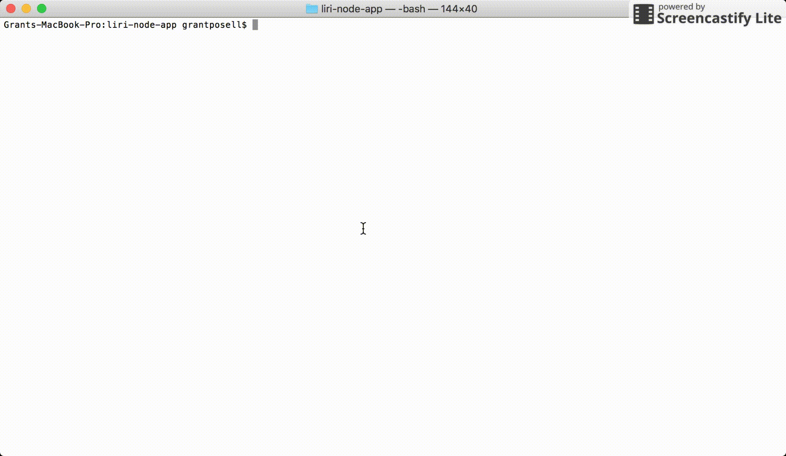

# liri-node-app
This is a LIRI Node.js application.

LIRI stands for Language Interpretation and Recognition Interface.

This application allows users to search for information via server-side without an User Interface using native JavaScript over Node.js.

In this particular application, you can search to see what tweets have been tweeted by an account and in particular it is the Naught X charger network. Simply type "node liri my-tweets" and it will pull the tweets that have been written on the account.

Next, you can search for information about songs through "node liri spotify-this-song insert song here" and it will even pull information from the Spotify npm module about a song.

Finally, you can pull information about movies by typing "node liri movie-this insertmovie here" as well to display movie information. 

Here is a demonstration of what you can find through this application. Hope you enjoy!

